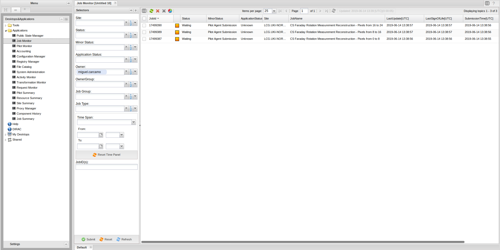

# SKA@IRIS

<details>
  <summary markdown="span"> Getting an X509 grid certificate </summary>
 
  TBD
  
</details>

<details>
  <summary markdown="span"> Creating a DIRAC UI on Windows</summary>
 
  Ha ha ha ha ha ha ha ha ha (etc.)
  
</details>

<details>
  <summary markdown="span"> Creating a DIRAC UI on Mac OSX</summary>
 
  Once you have created a Linux virtual machine you should ssh into it and follow the steps below for creating a DIRAC UI on a Linux machine.
</details>

<details>
  <summary markdown="span"> Creating a DIRAC UI on Linux</summary>
 
 <hr>
 
  There are three steps to making your own machine a DIRAC UI. You only ever need to do this once. There are three scripts that you will need: [runMeForCertAndKey](https://raw.githubusercontent.com/as595/SKA-IRIS/master/DIRACUI/runMeForCertAndKey), [InstallDirac.sh](https://raw.githubusercontent.com/as595/SKA-IRIS/master/DIRACUI/InstallDirac.sh) and [SetGridProxy](https://raw.githubusercontent.com/as595/SKA-IRIS/master/DIRACUI/SetGridProxy).
  
  * The first step is to activate your grid certificate and obtain a grid key: 
  
  ```bash
  ./runMeForCertAndKey /path/to/mycert.p12
  ```
  The script will ask you for your password **four times**. Yes, you read that correctly, *four times*. It will create a directory called <code>.globus</code> and put its outputs in there.

  * The second step is to install DIRAC and set your grid proxy, telling it you'e part of the skatelescope.eu VO:

  ```bash
  ./InstallDirac.sh
  ```

  * Finally you need to source the DIRAC init scripts depending on what shell do you use:

  ```bash
  # For bash
  source ./dirac_ui/bashrc

  # For tcsh
  source ./dirac_ui/tcshrc
  ```
  You can then copy the contents of the DIRAC UI .bashrc into the .bashrc in your home area so that it is automatically called every time you log in or open a new terminal.

  At this point you should be all set up. You can test that things work by starting the DIRAC file catalogue client:

  ```bash
  dirac-dms-filecatalog-cli
  ```
  <hr>
  
</details>

<details>
  <summary markdown="span"> Regenerate your 24 hour grid proxy</summary>
 
  ```bash
  ./SetGridProxy
  ```
</details>

<details>
  <summary markdown="span"> Submitting a job using DIRAC </summary>
 
  <hr>
  
  Jobs are submitted to DIRAC using a string command in the DIRAC *job description language* (jdl). Typically this is wrapped in a script that makes it easier to visualise all the elements of the string. An example of a full job submission script is shown in [eMERLIN-CP-jobsubmit](./submitjob.md).
  
  <h3 id="header">Tags</h3>

  If you want to submit a high memory (1.5TB) job to one of the IRIS fat nodes, your JDL should specify:
  
  ```python
  jdl += 'Tags = "nordugrid-Condor-himem";\n'
  ```
  
  If you want to submit a standard 8-core job to IRIS, your JDL should specify:
  
  ```python
  jdl += 'Tags = "8Processors";\n'
  ```
  
  <hr>

   Alternatively, jobs can be submitted using the Python Dirac API. This makes easier your job submissions and script configuration. An example of a full submission script using the Dirac API can be found in [eMERLIN-jobsubmit-API](./submit_job_API.md). The documentation for the Dirac API Job methods can be found here [API-Methods](https://dirac.readthedocs.io/en/latest/CodeDocumentation/Interfaces/API/Job.html).
 
<h3 id="header">Methods</h3>

```python   
# First create your job object
job = Job()

# Then we can use the methods
# Setting the name of the job
job.setName('my job name')
    
# Setting the platform
job.setPlatform('EL7')
    
# Adding your tags, they have to be set as a list of strings.
tags = ['nordugrid-Condor-himem', '8Processors']
job.setTag(tags)

# Set destination site
job.setDestination('LCG.UKI-NORTHGRID-MAN-HEP.uk')
    
# Set the executable and its arguments (arguments must be in a single string)
job.setExecutable('/bin/echo', arguments='hello')
``` 
<hr>
  
</details>

<details>
<summary markdown="span"> Submit a job and use Singularity containers </summary>
<hr>
[Singularity](https://singularity.lbl.gov) is installed in each node of the computer grid. Therefore, you can use your own containers to compile and run your applications. We recommend:

- Upload your recipe to a hub like [Singularity HUB](https://singularity-hub.org/) or [Docker Hub](https://hub.docker.com/).
- Run a bash script in your container running the command <code>singularity exec [options] [URI] bash mybashscript.sh</code> in your python DIRAC script.

<hr>
</details>

<details>
  <summary markdown="span"> Uploading data to the DIRAC file catalogue </summary>
  
  <hr>
  
  From your DIRAC UI you can add a dataset to the DIRAC file catalogue using the <code>dirac-dms-add-file</code> command. This example uploads the local file <code>myfile.txt</code> to the file catalogue on the Manchester HEP storage, where it is renamed <code>newfile.txt</code> and placed in the user directory in an individual user's folder. User folders have the format <code>firstname.lastname</code>.
  
  ```bash
  dirac-dms-add-file /skatelescope.eu/users/m/my.name/newfile.txt /path/to/myfile.txt UKI-NORTHGRID-MAN-HEP-disk
  ```

 If you want to add a set o files, you must tar them and then upload tarred file using the <code>dirac-dms-add-file</code> instruction. Then you must untar them in your submitted script. 
 <hr>
 
</details>

<details>
  <summary markdown="span"> Downloading data from the DIRAC file catalogue </summary>
 
</details>

<details>
  <summary markdown="span"> Tracking the status of your jobs </summary>
  If you have received your certificate and you have installed it in you browser then on the [GRIDPP webpage](https://dirac.gridpp.ac.uk:8443) you can track the progress of your submitted jobs. In this section we will give a few examples of how to track them.

1. Waiting: This status means that your job/s tags are being studied to be scheduled in a node that fits your requirements.


2. Running: Your job is actually running in one of the nodes of the grid.
3. Failed: For some reason your job failed. To know the reason you should download the StdOutput file from the SandBox. Additionally, we recommend to send your StdOutput prints to a txt file and then add it to a SandBox.
</details>
